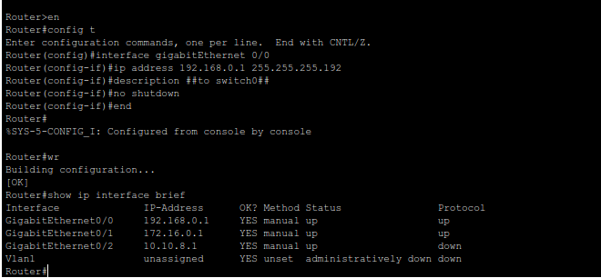

# Mini Project #1 
## by Christopher Vazquez

### 
Objective
 

The objective of this exercise is to conjoin two separate local area networks, with each LAN containing a plethora of end devices, such as a DNS, DHCP, Web Server, and some personal devices like a laptop and PC. Each PC and Laptop should be able to access the services from the separate LAN. 

***

### 
Use Cases

Scenario #1: These are the building blocks used for creating a private Intranet, where information does not leave the network. If you're able to create a direct connection (that you own) between two different Data Centers, this method would work. 

Scenario #2: IoT devices are traditionally not secure, so you can isolate these devices in its own separate network. 

***

### 
Detailed Steps

**
Step 1: Procure the nessecary equipment for this lab. In the case of the Diagram attached to this repository, we will need:
** 

   - Four computers (two for each LAN)
   - A Router (Cisco 2900 series)
   - Two Switches
   - Six RJ45 Ethernet cables
   - One serial cable (USB to DB9 to RJ45)

**
Step 2: Connect all of your devices together.
**

Please refer to the system architecture diagram in ***Figure 1***, as all of the end devices for each LAN need to connect into their switch. The only devices that the router will connect to are the switches.

---

**
Step 3: Prepping the Router
**

Please take the serial to RJ45 adapter and plug the RJ45 end into the CONSOLE port of the router. Connect the other end directly into your computer. 

**
Step 3.1: Console in
**

Please ensure that you one of the following programs installed, dependent on your operating system:

 - macOS: homebrew
 - Linux: apt-get
 - Windows: PuTTY

 Regardless of your operating system, you will need to find the port that your serial cable is connected to. 

For Windows devices, find the port in your Device Manager. Look for the submenu "Ports (COM & LPT). Make note of the port you see (such as COM1, COM2, COM#). 

Go to PuTTY, set the connection to serial, and paste the port found from the Device Manager. The default Baud rate is 9600, so change this setting if it is *not* 9600, as the connection will fail.

Click on Connect. If successful, you will see a black window pop up. Hit return until you see a prompt, such as "Router>"

For Unix devices (macOS, Linux): open your terminal and type ls /dev/*usb* to find the port need to console in. An example would be "usbtty0".

If you do not have "screen" installed already, please do the following.

Linux: <code>sudo apt-get install screen</code>

Once downloaded, ensure that the cable is connected to your computer and the router. **Ensure the router is on.**

Both Linux and macOS devices simply need to write the following command. Replace the brackets with the port found earlier without the quotes. Use sudo if it fails. If successful, the terminal will go blank. Hit return until you see a prompt, such as "Router>"

<code>screen /dev/{port} 9600</code>

Example: <code style="color:skyblue">screen /dev/usbtty0 9600</code>

**
Step 3.2: Configuring the router
**

For this lab, we will be using a Cisco 2900 series router, so these instructions are meant specifically for Cisco's IOS. Please consult your router's documentation if the router does match.

Please take a look at Figure 2 for the commands to set up a port configuration on a Cisco 2900 Series Router. This is for LAN0. Repeat the same steps for LAN1. 

**
Step 4: Configuring End Devices
**

Once your router is configured, each of the end devices need to have their IP addresses configured. Each system will not have the same configuration, but they all need to have mappings for:

    - Default Gateway
    - DNS Server
    - Personal IP address 
    - Subnet Mask

For example, let's take a look at Web Server0's configuration:

Since the IP block is 192.168.0.0/26, we can use the information to plug in the following.

    - Default Gateway (or Router IP): 192.168.0.1
    - DNS Server: 192.168.0.3 

    - Personal IP address: 192.168.0.4
    - Subnet Mask: 255.255.255.192

You can choose any mapping for the Personal IP address as long as it's exclusive to that machine. Two servers cannot share the same personal IP address. The DNS Server's IP is the personal IP address. All other machines need to point to the DNS server for their "DNS Server" option.

**
Step 5: Configuring Services
**

For DNS, NAMO was used for DNS and Apache2 was used for the Web server. 

Apache2 simply requires being installed for it to work on Linux machines. It comes with a webpage to test if the service is working. Configuring Apache2 is done through the terminal.

NAMO requires adding an A record for the service to work. 

Once your services are set up, ping the other network. 

Example: Have DNSServer0 ping WebServer1. If that works, type WebServer1's IP into a browser to see if the webpage pops up. If it does, try again with the domain name set. If it works, you're all set!

***

### 
FAQ

Q: What if I can’t see the console?

Try these troubleshooting techniques:

1. Make sure the router is on.

2. Make sure you have the correct path to your console cable, such as /ls/dev/usbtty0

3. Make sure the baud rate matches the router’s baud rate. For the Cisco 2900 series, that baud rate is 9600.

4. Try a different console emulator (such as PuTTY)

5. Try a different cable.
- DB9 cables are prone to breaking. If a direct Ethernet connection is possible, take that option. You do not need a DB9 nessecarily to console in to equipment, especially if the device doesn’t have a DB9 port.

Q: What if I can’t ping the other LAN?

1. Ping the router first. If you can ping the router, you may want to check the settings on the other port.

2. Ping someone within your LAN. If you can, then your settings are correct. Inform the other LAN to check their settings. If you cannot ping anyone, check your IP, subnet mask, and default gateway to see if it’s typed correctly.

Q: I can’t execute any commands in the console?

A: Make sure you are in the correct mode. You need to enable executive priveleges by typing:

<code>en</code>

Before execution, it should like this: <code>Router></code>

You will get this output: <code>Router#</code>

***

### 
Retrospective

Setbacks and Challenges

There weren’t many setbacks on my end for this project, as I have the unfair advantage of being in the industry for over a year, on top on having great mentors and the will to accelerate my learning. Consoling in at this point wasn’t foreign of a concept for me, and neither was configuring IP addresses. 

I did struggle to understand that the power button flicked down indicates that the router is not on. We spent most of the class trying to troubleshoot the console until I realized the router wasn’t even on in the first place. Whoops!

Insights

What was very new to me was learning how to accomplish all of what I’ve previously done into a Linux environment. My laptop at work runs on Windows 11, so for consoling in, I used PuTTY. On Linux, because PuTTY does not work on my computer, I went with screen, which is much easier to use. I also never knew how to set up my own web server, but that wasn’t too horrible of an issue. I have Ollama and Chatbox installed on my computer, so even when I have zero connection to the internet, I’m still able to ask Llama3.1 questions on the fly, which helped accelerate my teams progress tremendously. 

Going through the console on the router has helped me revisit the console for my own capstone project. My project is designed to help better automate the provisioning process for bare metal servers, with version 1.0 meant to configure the IPMI of a server. 

Improvement

If there is anything that I can improve on in the future, it would be simply allowing others to do more of the work, since I’ve carried the team heavily throughout this project.

    

